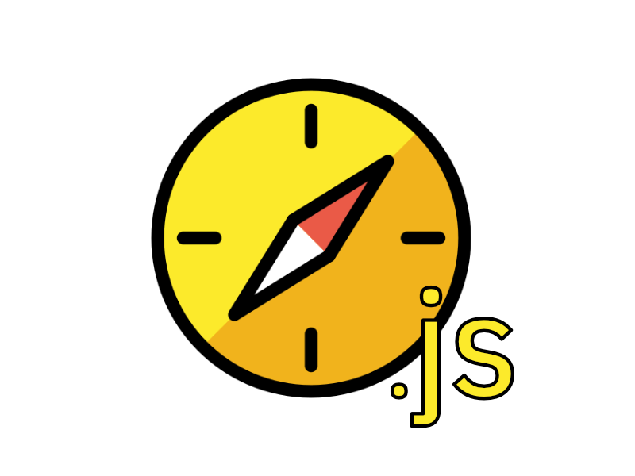

# compass.js
A minimal javascript library for accessing the compass direction of a user relative to North.

```html
<script src="https://unpkg.com/@joeyklee/compass.js@latest/dist/compass.js"></script>
```




## Quickstart

Include the reference to the script:
```html
<script src="https://unpkg.com/@joeyklee/compass.js@latest/dist/compass.js"></script>
```

Using Async/Await
```js
window.addEventListener("DOMContentLoaded", async() => {
  const compass = new Compass();
  await compass.init();

  const bearingToNorth = compass.getBearingToNorth();
  console.log(bearingToNorth); // 0;
})
```

Using Callbacks
```js
window.addEventListener("DOMContentLoaded", () => {
  const compass = new Compass();
  compass.init(compassLoaded);


  function compassLoaded(){
    const bearingToNorth = compass.getBearingToNorth();
    console.log(bearingToNorth); // 0;
  }
  
});
```

## Docs

You can read the docs to get a better understanding of the Compass `class`. 

See: [Docs](./docs/)

## Examples


Here's a few examples to get you started:

* [p5 example](./examples/p5-compass)
* [Vanillajs example](./examples/vanillajs-compass)
* [Mapboxgl example](./examples/mapboxgl-example);


## Develop

To develop the Compass you can install the development dependencies and run the tests below. 

### Setup

```sh
$ npm install
```

### Tests

```sh
$ npm run test
```

### Generate Docs

```
$ npm run docs
```

### Examples

```
$ npm run examples
```

## TODO
* [ ] Add webpack build
* [ ] Allow customization for device orientation access trigger

## Credits
* Built by [Joey Lee](https://jk-lee.com)


## Notes
* A note on new iphone devices
  * device orientation requires user to confirm with a gesture
* A note on compass directions:
  * 0 deg = north 
  * 90 deg = east
  * 180 deg = south
  * 270 deg = west